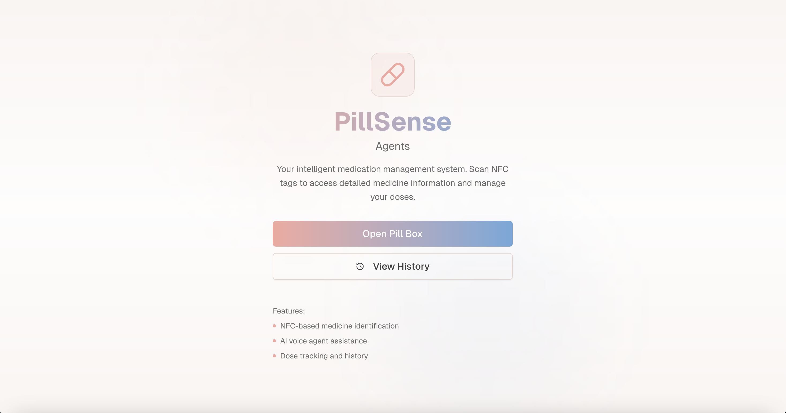
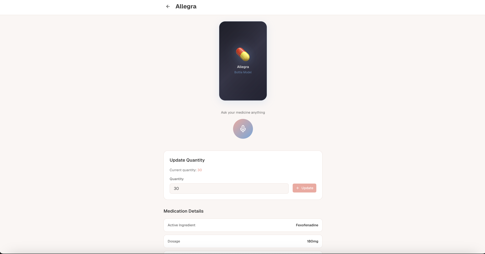
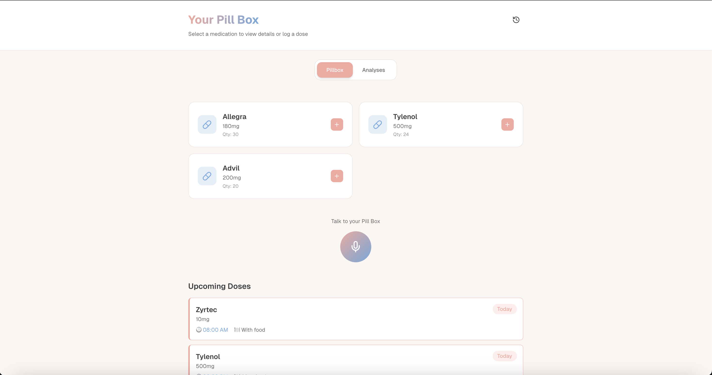

# 💊 PillSense AI

> **Smart medication management powered by AI, voice, and data analytics**

<div align="center">

[](https://vercel.com/new/clone?repository-url=https://github.com/RadonUmar/PillSenseAI)
[](https://nextjs.org/)
[](https://neon.tech/)
[](https://www.tableau.com/)

**[Live Demo](https://pill-sense-ai-sbow.vercel.app)** • **[Report Bug](https://github.com/RadonUmar/PillSenseAI/issues)** • **[Request Feature](https://github.com/RadonUmar/PillSenseAI/issues)**

</div>

---

## 🚀 What is PillSense?

PillSense is a **next-generation medication management platform** that combines NFC technology, AI-powered voice assistance, and advanced health analytics to revolutionize how people track and manage their medications.

### 🎯 Core Features

- **🏷️ NFC-Enabled Tracking** - Tap your medication bottle to instantly log doses
- **🎤 Voice-Activated Assistant** - Ask questions about your medications hands-free (powered by VAPI)
- **📊 Health Risk Analytics** - ML-powered risk assessment using clinical vital signs
- **📈 Tableau Dashboard** - Interactive data visualizations for medication adherence and health trends
- **⏰ Smart Scheduling** - Automated dose reminders with food instructions
- **📱 Mobile-First Design** - Responsive interface that works everywhere
- **🔒 Secure & Private** - Your health data stays protected

---

## 📸 Screenshots

### Homepage
<!-- ADD SCREENSHOT HERE: Homepage with hero section and features -->


### Medicine Details
<!-- ADD SCREENSHOT HERE: Individual medicine page with dosage info, warnings, and voice assistant -->


### Smart Pill Box
<!-- ADD SCREENSHOT HERE: Pill box view with medications grid, upcoming doses, and analytics tab -->


---

## 🛠️ Tech Stack

### Frontend
- **Framework**: Next.js 16 (App Router)
- **UI**: React 18, TailwindCSS 4, Radix UI
- **Voice**: VAPI AI (Real-time voice streaming)
- **Analytics**: Tableau Embedded Dashboard

### Backend
- **Database**: PostgreSQL (Neon Serverless)
- **ORM**: Prisma 6
- **API**: Next.js API Routes
- **ML**: Custom decision tree classifier for health risk prediction

### Deployment
- **Hosting**: Vercel
- **CI/CD**: GitHub Actions (Auto-deploy)
- **Database**: Neon (Serverless Postgres)

---

## 🏃 Quick Start

### Prerequisites

```bash
node >= 18.0.0
npm >= 9.0.0
```

### Installation

1. **Clone the repository**
```bash
git clone https://github.com/RadonUmar/PillSenseAI.git
cd PillSenseAI
```

2. **Install dependencies**
```bash
npm install
```

3. **Set up environment variables**
```bash
cp .env.example .env
```

Add your credentials to `.env`:
```env
DATABASE_URL="your_postgresql_url"
DIRECT_URL="your_postgresql_direct_url"
NEXT_PUBLIC_VAPI_PUBLIC_KEY="your_vapi_key"
NEXT_PUBLIC_VAPI_ASSISTANT_ID="your_vapi_assistant_id" # Optional
```

4. **Set up the database**
```bash
npx prisma db push
npx prisma db seed
```

5. **Run the development server**
```bash
npm run dev
```

Visit [http://localhost:3000](http://localhost:3000) 🎉

---

## 🧠 How It Works

### 1. Health Risk Prediction Model

PillSense uses a **decision tree classifier** that analyzes clinical vitals:

- **Respiratory Rate** (Normal: 12-20 breaths/min)
- **Oxygen Saturation** (Normal: 95-100%)
- **Heart Rate** (Normal: 60-100 bpm)
- **Blood Pressure** (Normal: <120/80 mmHg)
- **Oxygen Therapy Status**

The model outputs three risk levels: **Low**, **Medium**, or **High**, helping users understand their health status at a glance.

### 2. Voice-Activated Medication Assistant

Powered by **VAPI AI**, users can:
- Ask about medication dosages and side effects
- Get reminders for upcoming doses
- Query their medication history
- Receive personalized health advice

### 3. Smart NFC Integration

Each medication can be tagged with an NFC chip. Simply tap your phone to:
- ✅ Log a dose instantly
- 📊 View medication details
- 🔔 Set up reminders

### 4. Data Analytics Dashboard

Built with **Tableau**, the analytics panel provides:
- 📊 Medication adherence trends
- 🗓️ Calendar heatmap of dose logs
- 📈 Risk level tracking over time
- ⚡ Real-time health insights

---

## 📂 Project Structure

```
PillSense/
├── app/                    # Next.js app directory
│   ├── api/               # API routes
│   │   ├── medications/   # Medication CRUD
│   │   ├── pillbox/      # Pill box management
│   │   ├── dose-logs/    # Dose logging
│   │   └── risk/         # Health risk analysis
│   ├── pillbox/          # Pill box page
│   ├── medicine/         # Medicine details pages
│   └── admin/            # Admin dashboard
├── components/            # React components
│   ├── AnalysisPanel.tsx # Analytics dashboard
│   ├── RiskLevelCard.tsx # Risk visualization
│   └── VitalsSummaryCard.tsx
├── hooks/                 # Custom React hooks
│   └── useVapiAgent.ts   # Voice assistant logic
├── lib/                   # Utility libraries
│   ├── csv-loader.ts     # Health dataset loader
│   ├── risk-prediction.ts # ML model
│   └── vapi-context.ts   # Voice context builder
├── prisma/               # Database schema & seeds
│   ├── schema.prisma
│   ├── seed.ts
│   └── seed-upcoming.ts
└── data/                 # Health risk dataset (CSV)
```

---

## 🤝 Contributing

Contributions are welcome! Here's how you can help:

1. Fork the repository
2. Create your feature branch (`git checkout -b feature/AmazingFeature`)
3. Commit your changes (`git commit -m 'Add some AmazingFeature'`)
4. Push to the branch (`git push origin feature/AmazingFeature`)
5. Open a Pull Request

---

## 📝 License

This project is licensed under the MIT License - see the [LICENSE](LICENSE) file for details.

---

## 🙏 Acknowledgments

- **VAPI AI** - Voice assistant technology
- **Neon** - Serverless PostgreSQL database
- **Vercel** - Deployment platform
- **Tableau** - Data visualization

---

## 📞 Contact

**Umar Ghani** - [@RadonUmar](https://github.com/RadonUmar)

**Project Link**: [https://github.com/RadonUmar/PillSenseAI](https://github.com/RadonUmar/PillSenseAI)

**Live Demo**: [https://pill-sense-ai-sbow.vercel.app](https://pill-sense-ai-sbow.vercel.app)

---

<div align="center">

**⭐ Star this repo if you find it helpful!**

Made with 💊 and ☕

</div>
